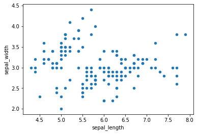
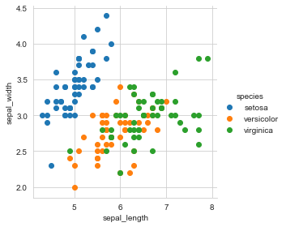
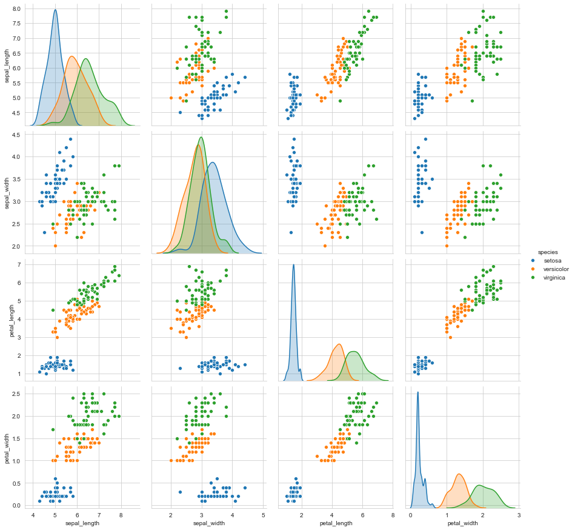
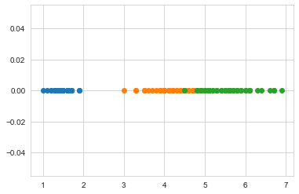
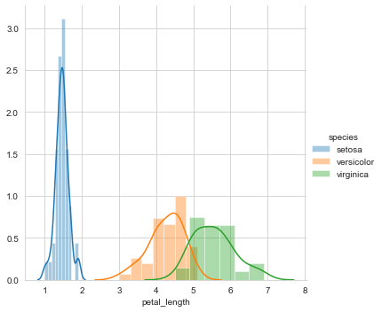
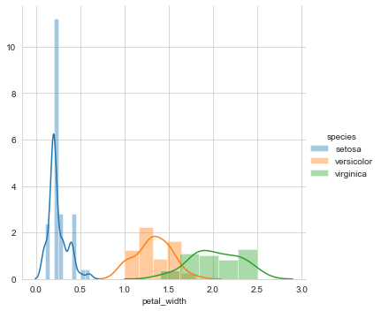
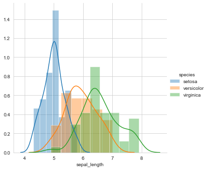
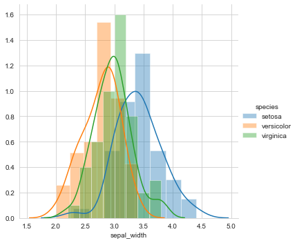
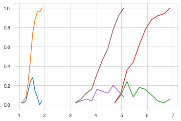

Data Analysis of Irish Flower species.\
Toy Dataset: Iris Dataset: [https://en.wikipedia.org/wiki/Iris_flower_data_set]\
A simple dataset to learn the basics of different python libraries and data anaylisis.\
3 flowers of Iris species\
Objective: Classify a new flower as belonging to one of the 3 classes given the 4 features.\
Features: petal width, petal length, sepal width, sepal length.\


    


```python
import pandas as pd
import seaborn as sns
import matplotlib.pyplot as plt
import numpy as np

iris = pd.read_csv("https://raw.githubusercontent.com/uiuc-cse/data-fa14/gh-pages/data/iris.csv")
```


```python
print(iris.shape) #data points and features
```

    (150, 5)
    


```python
print(iris.columns) #column names
```

    Index(['sepal_length', 'sepal_width', 'petal_length', 'petal_width',
           'species'],
          dtype='object')
    


```python
iris["species"].value_counts()#Datapoints/flowers for each class/specie
```


    virginica     50
    versicolor    50
    setosa        50
    Name: species, dtype: int64


```python
iris.plot(kind= "scatter", x="sepal_length", y="sepal_width")
plt.show()
```





```python
sns.set_style("whitegrid");
sns.FacetGrid(iris, hue="species", height=4) \
    .map(plt.scatter, "sepal_length", "sepal_width") \
    .add_legend();
plt.show()
```





```python
#Blue point can be easily separated from red and green.
#But red and green data points can not be easily separated
#Using sepal_length and sepal_width features, we can distinguish Setosa flowers from others
#Separating Versicolor from Virginica is harde beacuse they overlap
#So, try using pair-plot
```


```python
sns.set_style("whitegrid");
sns.pairplot(iris, hue="species", height= 3);
plt.show()
```





```python
#petal_length and petal_wdth  are the most useful features to identify various flower types
#pairplots useful til 5/6 features
#What about using 1D scatter plot using just one feature?
```


```python
iris_setosa = iris.loc[iris["species"] == "setosa"];
iris_virginica = iris.loc[iris["species"] == "virginica"];
iris_versicolor = iris.loc[iris["species"] == "versicolor"];

plt.plot(iris_setosa["petal_length"], np.zeros_like(iris_setosa["petal_length"]), 'o')
plt.plot(iris_versicolor["petal_length"], np.zeros_like(iris_versicolor["petal_length"]), 'o')
plt.plot(iris_virginica["petal_length"], np.zeros_like(iris_virginica["petal_length"]), 'o')

plt.show()
```





```python
#points are overlaping and really hard to read
#What about an histogram?
```


```python
sns.set_style("whitegrid");
sns.FacetGrid(iris, hue="species", height=5) \
    .map(sns.distplot, "petal_length") \
    .add_legend()
plt.show()
```





```python
#Histogram of petal_length of each flower
#y axis represents how often we find this petal_length in each flower
#Smooth lines = PDF(Probability density function)
#petal_lenght = pl;
#Model 1 => if pl < 2 then setosa
#Model 2 => if pl >2 && pl<= 5.5 then versicolor // DO NOT WORK BECAUSE OVERLAPING
#Model 3 => if pl>5.5 then virginica // DO NOT WORK BECAUSE OVERLAPING

#So, my final model>
#if pl <= 2 then setosa
#else
#if pl < 4.7 then versicolor
#else
#virginica // BUT STILL NOT PERFECT

#Univariate analysis:
```


```python
sns.set_style("whitegrid");
sns.FacetGrid(iris, hue="species", height=5) \
    .map(sns.distplot, "petal_width") \
    .add_legend()
plt.show()

#The further the distribution are, the better
```





```python
sns.set_style("whitegrid");
sns.FacetGrid(iris, hue="species", height=5) \
    .map(sns.distplot, "sepal_length") \
    .add_legend()
plt.show()

#Worst overlaping
```





```python
sns.set_style("whitegrid");
sns.FacetGrid(iris, hue="species", height=5) \
    .map(sns.distplot, "sepal_width") \
    .add_legend()
plt.show()

#Worst overlaping
```





```python
#From previous plot: PL>PW>>>SL>>SW
```


```python
#Cumulative Distribution FUnction CDF
#Plot CDF of petal_length
```


```python
counts, bin_edges = np.histogram(iris_setosa['petal_length'], bins=10, 
                                 density = True)
pdf = counts/(sum(counts))
print(pdf);
print(bin_edges)
cdf = np.cumsum(pdf)
plt.plot(bin_edges[1:],pdf)
plt.plot(bin_edges[1:], cdf)


# virginica
counts, bin_edges = np.histogram(iris_virginica['petal_length'], bins=10, 
                                 density = True)
pdf = counts/(sum(counts))
print(pdf);
print(bin_edges)
cdf = np.cumsum(pdf)
plt.plot(bin_edges[1:],pdf)
plt.plot(bin_edges[1:], cdf)


#versicolor
counts, bin_edges = np.histogram(iris_versicolor['petal_length'], bins=10, 
                                 density = True)
pdf = counts/(sum(counts))
print(pdf);
print(bin_edges)
cdf = np.cumsum(pdf)
plt.plot(bin_edges[1:],pdf)
plt.plot(bin_edges[1:], cdf)


plt.show();
```

    [0.02 0.02 0.04 0.14 0.24 0.28 0.14 0.08 0.   0.04]
    [1.   1.09 1.18 1.27 1.36 1.45 1.54 1.63 1.72 1.81 1.9 ]
    [0.02 0.1  0.24 0.08 0.18 0.16 0.1  0.04 0.02 0.06]
    [4.5  4.74 4.98 5.22 5.46 5.7  5.94 6.18 6.42 6.66 6.9 ]
    [0.02 0.04 0.06 0.04 0.16 0.14 0.12 0.2  0.14 0.08]
    [3.   3.21 3.42 3.63 3.84 4.05 4.26 4.47 4.68 4.89 5.1 ]
    





```python
#Objetive: classication
# Plots of CDF of petal_length for various types of flowers.
#95% of versica flower: pl>2 && pl<= 5 then versicolor
#So, i will be correct 95% of the times
```


```python
#Mean
print("Means:")
print(np.mean(iris_setosa["petal_length"]))
print(np.mean(iris_virginica["petal_length"]))
print(np.mean(iris_versicolor["petal_length"]))
```

    Means:
    1.464
    5.552
    4.26
    


```python
#Setosa has a smaller petal lenght in average
#Setosa mean with an outlier:

print(np.mean(np.append(iris_setosa["petal_length"],50)));
```

    2.4156862745098038
    


```python
#PROBLEM with mean

print("\nStd-dev:");
print(np.std(iris_setosa["petal_length"]))
print(np.std(iris_virginica["petal_length"]))
print(np.std(iris_versicolor["petal_length"]))

```

    
    Std-dev:
    0.17176728442867115
    0.5463478745268441
    0.4651881339845204
    


```python
#Std -> spread

#Median = similar to mean but outliers do not affect them
print("\nMedians:")
print(np.median(iris_setosa["petal_length"]))

print(np.median(iris_virginica["petal_length"]))
print(np.median(iris_versicolor["petal_length"]))
```

    
    Medians:
    1.5
    5.55
    4.35
    


```python
#Setosa Median with an outlier
print(np.median(np.append(iris_setosa["petal_length"],50)));
```

    1.5
    


```python
#No problem with variance

print("\nQuantiles:")
print(np.percentile(iris_setosa["petal_length"],np.arange(0, 100, 25)))
print(np.percentile(iris_virginica["petal_length"],np.arange(0, 100, 25)))
print(np.percentile(iris_versicolor["petal_length"], np.arange(0, 100, 25)))

print("\n90th Percentiles:")
print(np.percentile(iris_setosa["petal_length"],90))
print(np.percentile(iris_virginica["petal_length"],90))
print(np.percentile(iris_versicolor["petal_length"], 90))
```

    
    Quantiles:
    [1.    1.4   1.5   1.575]
    [4.5   5.1   5.55  5.875]
    [3.   4.   4.35 4.6 ]
    
    90th Percentiles:
    1.7
    6.3100000000000005
    4.8
    


```python

```
Conclusion:\
1. Using sepal_length and sepal_width features, we can distinguish Setosa flowers from others\
2. Petal_length and petal_wdth  are the most useful features to identify various flower types\
3. Model: 
-petal_length <= 2, the specie is setosa
-petal length >2 and < 4.7, the specie is versicolor, with a 25% margin of error
-petal lenght > 4.7, the specie is virginica, again with a 25% margin of error
